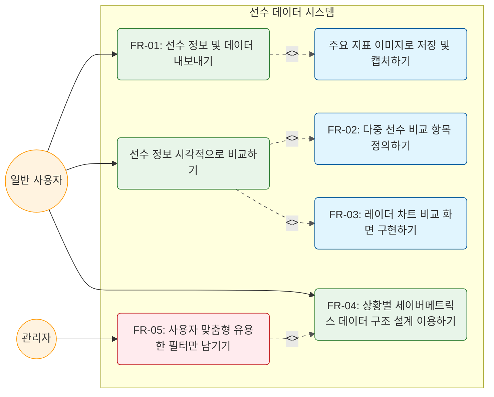
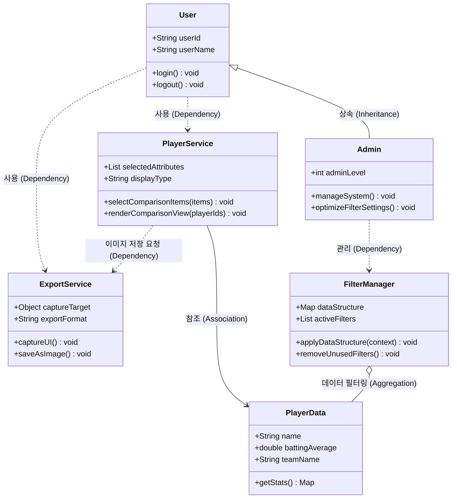

# M2 설계 보고서: 야구 정보 조회 시스템

---

## 1. M1 요약 및 변경 이력

### M1 핵심 요약
* **프로젝트명**: 야구 정보 조회 시스템 (세이버메트릭스 및 시각화 플랫폼)
* **프로젝트 목적**: 약자 위주의 복잡한 KBO 기록실 데이터로 인한 진입 장벽을 낮추고, 일반 팬부터 전문가까지 활용할 수 있는 직관적인 세이버메트릭스 지표와 시각화(대시보드, 선수 카드) 분석 도구를 제공함
* **주요 기능 요구사항**: 세이버메트릭스 지표 산출/조회, 사용자 맞춤형 대시보드(입문자/일반/분석가), 검색 및 레이더 차트 비교, 선수 정보 카드화 및 공유 기능
* **팀 역할 구성**: 김성원(PM), 김소리(분석가), 김민석(설계자), 유소현(개발자), 한정민·박지민(QA/보안)

### 변경 이력 테이블

| 변경 일자 | 항목 | 변경 전 | 변경 후 | 변경 사유 |
| :--- | :--- | :--- | :--- | :--- |
| 9주차 | 기능 요구사항 | 단순 세이버메트릭스 지표 나열 및 조회 | 사용자의 경험 수준에 따른 3가지 맞춤형 대시보드(입문자, 일반 팬, 분석가 모드) 제공 및 선수 정보 카드화 기능 구체화 | 야구 입문자부터 전문가까지의 다양한 타깃층 만족 및 공유 활성화 유도 |
| 10주차 | 시스템 범위 | KBO 공식 데이터 단순 연동 | 수집·정규화 연산 레이어와 AI 기반 자연어 설명 프레젠테이션 레이어 설계 도입 | 복잡한 세부 통계 지표를 직관적인 문장으로 변환하여 사용자 편의성 제공 목적 |

---

## 2. UML 다이어그램

### 2-1. 유스케이스 다이어그램 (Use Case Diagram)

시스템이 제공하는 핵심 기능구조와 사용자(일반 사용자, 관리자) 간의 유기적 관계를 정의한 다이어그램입니다. 기능 요구사항(FR)과 유스케이스가 명확히 매핑되도록 '동사 + 목적어' 형태로 작성하였습니다.



### 2-2. 클래스 다이어그램 (Class Diagram)

유스케이스의 기능 단위를 객체지향 컴포넌트로 구체화하고 클래스 간의 관계(상속, 의존, 참조 연관, 집합)를 속성과 메서드를 포함하여 정의했습니다.



#### UML AI 활용 검토 체크리스트 적용 결과

* [o] 모든 FR(기능 요구사항 FR-01 ~ FR-05)이 유스케이스 및 클래스 기능으로 매핑되었는가?
* [o] `User`와 `Admin` 액터가 실제 사용자 역할과 논리적으로 일치하는가?
* [o] `<<include>>`와 `<<extend>>` 관계 및 클래스 간의 관계(상속, 의존, 집합)가 객체지향 표준에 맞게 표현되었는가?
* [o] 클래스별로 최소 2개 이상의 속성 및 메서드가 명확한 도메인 용어로 명시되어 있는가?

---

## 3. 설계 패턴 적용 내역

### 3-1. 싱글톤 패턴 (Singleton Pattern) — 생성 패턴

* **대상 클래스**: `FilterManager`, `ExportService`
* **선택한 이유**: 야구 정보 조회 시스템에서는 대용량의 선수 원천 데이터 세트와 세이버메트릭스 지표 연산용 필터를 전역에서 일관되게 관리해야 합니다. `FilterManager` 인스턴스가 여러 개 생성될 경우 필터 기준이 혼선되거나 리소스 낭비가 발생할 수 있습니다. 또한 기기 저장용 파일 출력을 담당하는 `ExportService` 역시 시스템 내에서 단 하나의 제어권을 유지해야 충돌이 없습니다.
* **구체적 적용 설명**: 두 클래스의 생성자를 `private`으로 제한하고 내부에서 단 하나의 정적 객체 인스턴스만을 유지하도록 `getInstance()` 메서드를 구현하여 시스템 전역에서 동일한 필터 상태와 출력 엔진을 공유하도록 설계했습니다.

### 3-2. 전략 패턴 (Strategy Pattern) — 행동 패턴

* **대상 클래스**: `PlayerService`와 대시보드 출력 인터페이스
* **선택한 이유**: 기기 환경이나 사용자 등급(입문자 모드, 일반 팬 모드, 분석가 모드)에 따라 화면에 데이터를 바인딩하고 시각화하는 알고리즘이 완전히 달라집니다. 이를 단일 메서드 내의 거대한 `if-else`문으로 처리하면 향후 새로운 지표나 시각화 모드가 추가될 때 소스 코드가 매우 복잡해집니다.
* **구체적 적용 설명**: 대시보드 렌더링 방식을 인터페이스화하여 각 모드별(`BeginnerRender`, `FanRender`, `ExpertRender`) 알고리즘 클래스로 독립 분리했습니다. `PlayerService`는 사용자가 선택한 모드 전략 객체를 주입받아 동적으로 `renderComparisonView()`를 수행합니다.

---

## 4. SOLID 원칙 검토

### 4-1. SRP — 단일 책임 원칙 (Single Responsibility Principle)

* **검토 내용**: 하나의 클래스는 단 하나의 변경 이유와 책임을 가져야 합니다.
* **설계 반영**: `PlayerService` 클래스는 오직 선수의 통계 데이터를 가공하여 화면에 매핑하는 프레젠테이션 역할만 수행합니다. 화면을 캡처하고 이미지 파일로 저장하여 디바이스에 내보내는 물리적인 I/O 로직은 이 클래스에 섞지 않고 `ExportService`라는 별도의 전용 서비스 클래스로 완벽히 분리하여 SRP를 준수했습니다.

### 4-2. OCP — 개방-폐쇄 원칙 (Open/Closed Principle)

* **검토 내용**: 확장에는 열려 있어야 하고, 수정에는 닫혀 있어야 합니다.
* **설계 반영**: 사용자가 세이버메트릭스 데이터를 필터링할 때, 추후 새로운 야구 지표(wRC+, war 등)나 새로운 외부 연동 데이터 구조(EIF)가 확장될 가능성이 큽니다. 이를 위해 `FilterManager`가 구체적인 데이터 원본에 의존하지 않고 `PlayerData` 추상 구조 및 컨텍스트 인터페이스를 바라보게 설계함으로써, 기존 필터 알고리즘을 수정하지 않고도 자유롭게 필터 가짓수를 확장할 수 있도록 OCP를 충족했습니다.

### 4-3. LSP — 리스코프 치환 원칙 (Liskov Substitution Principle)

* **검토 내용**: 자식 클래스는 언제나 자신의 부모 클래스를 대체할 수 있어야 합니다.
* **설계 반영**: `User` 클래스를 상속받은 `Admin` 클래스는 부모 클래스가 가진 `login()`, `logout()` 메서드의 행위적 규약을 깨뜨리지 않고 그대로 상속하여 동일하게 동작합니다. 관리자만의 추가적인 권한 기능(`manageSystem`, `optimizeFilterSettings`)은 상속받은 기능을 오버라이딩하여 무력화하는 방식이 아니라 완전히 별도의 고유 메서드로 확장 정의되었으므로 LSP 원칙을 철저히 따르고 있습니다.

---

## 5. 다음 단계 계획

* **팀 내 Cross-check 계획**: 13주차에 설계자인 김민석이 구축한 클래스 다이어그램과 유소현 개발자의 프로토타입 소스 코드를 바탕으로 한정민, 박지민(QA/보안 담당)이 원칙 위반 여부 및 버그 교차 검증을 실시할 예정입니다.
* **최종본 제출 전 보완 설계 항목**: 3가지 맞춤형 대시보드(입문자/일반/분석가) 상태 전환에 필요한 UI Controller 구조와 연산 레이어 간의 구체적인 시퀀스 다이어그램을 보완 설계할 것입니다.
* **M3 최종 보고서 추가 내용 예고**: 수집 레이어의 데이터 정규화 알고리즘 검증 결과, 기능점수(64 FP) 산정에 따른 최종 투입 인월 수치 확정 및 AI 활용 로그 #2 통합본을 포함하여 완제품 보고서를 완성할 예정입니다.

```

```
