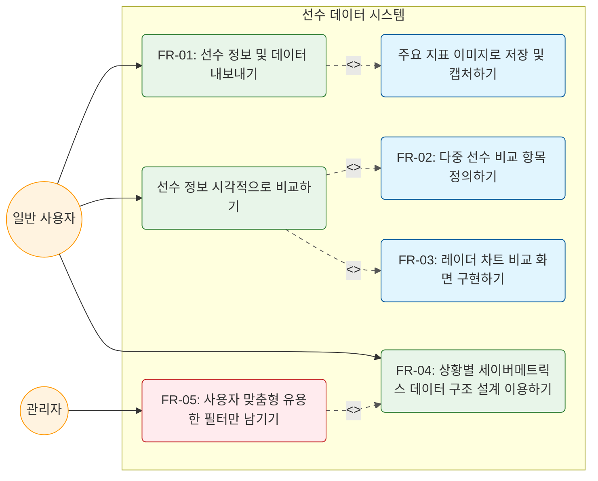
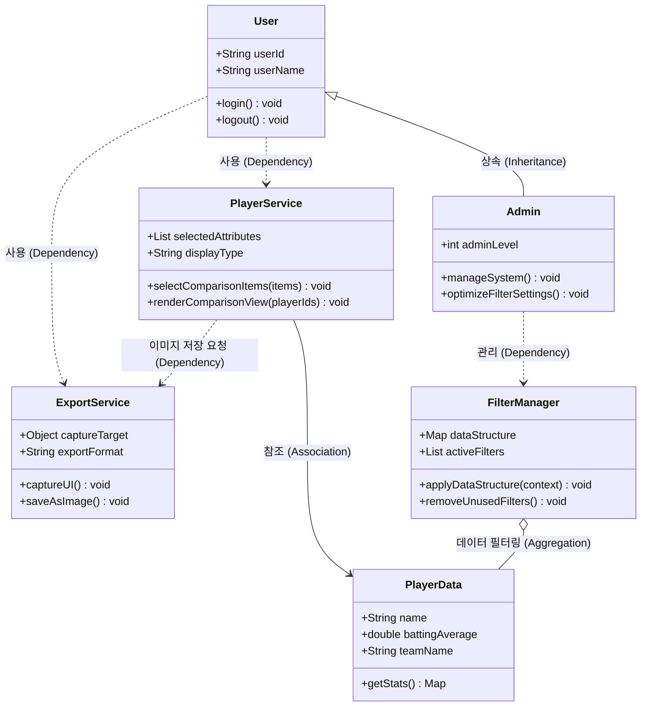

# M3 최종보고서

**프로젝트명**: KBO 야구 정보 조회 시스템  
**과목명**: 소프트웨어 공학 개론  
**담당 교수**:  
**제출 마일스톤**: M3 최종 보고서  

| 이름 | 학번 | 역할 | 주요 담당 항목 |
|------|------|------|----------------|
| 김성원 | | PM | 1·2·4·13 |
| 김소리 | | 분석가 | 3·5 |
| 김민석 | | 설계자 | 7·8·9 |
| 유소현 | | 개발자 | 6·8·11 |
| 한정민, 박지민 | | QA/보안 | 10·12 |

---

## 목차

1. 프로젝트 개요
2. 팀 구성 및 역할분담
3. 요구사항 정의서 (최종본)
4. WBS 및 프로젝트 일정 (계획 + 실적)
5. 비용 산정 결과
6. 협업 도구 운영 방식
7. UML 다이어그램 (최종본)
8. 설계 패턴 적용 내역
9. SOLID 원칙 검토
10. 인스펙션 결과 (팀 내 Cross-check)
11. 코딩 표준 문서
12. AI 활용 내역 요약
13. 회고 및 개선 사항

---

## 1. 프로젝트 개요

**주 작성자**: PM / **부 작성자**: 분석가

### 프로젝트명

KBO 야구 정보 조회 시스템 (세이버메트릭스 및 시각화 플랫폼)

### 배경 및 문제 정의

2026년도에 들어 야구의 인기가 나날이 높아지고 있다. 2026년 5월 1일 기준 한국 프로야구협회(KBO)에서 발표한 자료에 따르면 프로야구 총 관객수는 250만명이다. 야구는 기록원이 존재하여 매 경기마다 일어나는 상황과 결과를 기록하는 몇 안 되는 스포츠 중 하나로, "기록의 스포츠"라고 불리기도 한다.

KBO는 2015년부터 수비 및 주루 관련 세부 기록과 세이버메트릭스 지표를 추가하며 기록 서비스를 강화해왔다. 그러나 KBO 기록실에서는 선수 개개인의 지표를 약자로만 표기하고(예: 타율→AVG, 타석수→PA, 안타→H), 세이버메트릭스 지표(wRC+, WAR, OPS 등)를 직접 조회할 수 있는 공식 사이트가 국내에 부족하다. 투수의 구종 궤적이나 로케이션 정보를 확인할 수 있는 서비스도 거의 없는 실정이다. 이로 인해 야구 팬들은 타율과 ERA 두 지표에만 의존할 수밖에 없으며, 타율의 경우 타자 실력 지표로서의 정확도가 53%에 불과하다는 연구 결과도 있다.

### 목적

일반인이 접근하기 어려운 세부 통계 지표(세이버메트릭스)를 직관적이고 알기 쉽게 제공하고, 사용자의 수준과 목적에 따라 다른 형태의 데이터를 보여주는 유연한 시스템을 구축한다. 또한 직관적인 지표를 통해 선수의 가치와 팀 성적의 상관관계를 파악할 수 있는 분석 도구를 제공한다.

### 예상 사용자

야구 입문자, 일반 팬, 야구를 즐겨 보는 사람, 야구를 직업으로 삼는 사람(구단 관계자, 야구 학원 등)

### 주요 기능 요약

| # | 기능명 | 설명 |
|---|--------|------|
| 1 | 세이버메트릭스 지표 조회 | wRC+, WAR, OPS 등 심층 지표 및 타구속도·발사각·구종별 피안타율 조회 |
| 2 | 사용자 맞춤형 대시보드 | 입문자/일반 팬/분석가 3가지 모드 제공 |
| 3 | 선수 비교 분석 | 두 명 이상의 선수를 레이더 차트·그래프로 시각적 비교 |
| 4 | 필터 검색 | 포지션·시즌·소속 팀·세부 지표 범위 등 조건별 데이터 조회 |
| 5 | 선수 정보 카드화 및 공유 | 주요 지표를 카드 이미지로 변환하여 저장 및 SNS 공유 |

### M1 대비 변경 사항

| 변경 일자 | 항목 | 변경 전 | 변경 후 | 변경 사유 |
|----------|------|--------|--------|----------|
| 9주차 | 기능 요구사항 | 단순 세이버메트릭스 지표 나열 및 조회 | 사용자의 경험 수준에 따른 3가지 맞춤형 대시보드(입문자, 일반 팬, 분석가 모드) 제공 및 선수 정보 카드화 기능 구체화 | 야구 입문자부터 전문가까지의 다양한 타깃층 만족 및 공유 활성화 유도 |
| 10주차 | 시스템 범위 | KBO 공식 데이터 단순 연동 | 수집·정규화 연산 레이어와 AI 기반 자연어 설명 프레젠테이션 레이어 설계 도입 | 복잡한 세부 통계 지표를 직관적인 문장으로 변환하여 사용자 편의성 제공 목적 |

---

## 2. 팀 구성 및 역할분담

**주 작성자**: PM / **부 작성자**: 전원

| 이름 | 학번 | 역할 | 주요 담당 업무 |
|------|------|------|----------------|
| 김성원 |보안이슈로 작성하지  않음| PM | 프로젝트 전체 계획 수립, 일정 조율, 팀원 업무 관리, 프로젝트 총괄 |
| 김소리 | | 분석가 | 시스템에서 다룰 데이터 지표 분석, 사용자 요구사항 정의 |
| 김민석 | | 설계자 | 시스템 전체 구조, 데이터베이스 설계, 기능 흐름 및 UI/UX 기획·설계 |
| 유소현 | | 개발자 | 설계된 청사진을 바탕으로 실제 프로그래밍 코드 작성 및 구현 |
| 한정민, 박지민 | | QA/보안 | 개발된 프로그램 오류·버그 테스트, 품질 검증, 시스템 데이터 보안 검토 |

> 단, 모든 과정은 팀원 과반수 이상이 동의해야 하며, 모든 일정은 조율을 통해 유동적으로 한다.

### 역할 변경 이력

역할 변경 없음

---

## 3. 요구사항 정의서 (최종본)

**주 작성자**: 분석가 / **부 작성자**: PM

### 3-1. 기능 요구사항 (FR)

| ID | 요구사항 내용 | 우선순위 | 상태 |
|----|--------------|----------|------|
| FR-01 | 사용자는 정보의 공유를 원할 때 데이터 내보내기에서 이미지 저장(캡처 UI)이 가능해야 한다 | 하 | 확정 |
| FR-02 | 시스템은 선수 비교 기능 중 어떤 항목(타율, 구단 등 능력치)에 따라 비교할지 정의될 수 있어야 한다 | 상 | 확정 |
| FR-03 | 시스템은 선수 비교 기능 중에서 비교 화면을 구현(그래프, 카드 UI)할 수 있어야 한다 | 상 | 확정 |
| FR-04 | 시스템은 필터 기능에서 상황별 데이터 구조 설계가 되어 있어야 한다 | 상 | 확정 |
| FR-05 | 시스템은 필터 기능 중 사용자에게 유용한 필터만 남겨질 수 있어야 한다 | 중 | 확정 |

### 3-2. 비기능 요구사항 (NFR)

| ID | 품질 특성 | 요구사항 내용 | 우선순위 | 상태 |
|----|----------|--------------|----------|------|
| NFR-01 | 성능 | 선수별 데이터 업데이트 속도는 경기가 끝난 후 3시간 이내에 결과를 반영할 수 있어야 한다 | 상 | 확정 |
| NFR-02 | 사용성 | 초보자도 사용할 수 있게끔 인터페이스는 단순하며 핵심 정보를 담고 있어야 한다 | 상 | 확정 |

### 3-3. M1 대비 변경 이력

| 버전 | 변경일 | 변경 ID | 변경 유형 | 변경 내용 | 변경 사유 |
|------|--------|---------|----------|----------|----------|
| v1.0 | — | — | — | 최초 작성 (M1 기획서 기준) | — |

---

## 4. WBS 및 프로젝트 일정 (계획 + 실적)

**주 작성자**: PM / **부 작성자**: 전원

### 4-1. WBS

| # | 단계 | 작업 항목 | 담당자 | 산출물 | 계획 주차 | 실제 완료 주차 | 상태 |
|---|------|----------|--------|--------|----------|---------------|------|
| 1 | 기획 | GitHub 레포지토리 개설 | PM | 레포지토리 | 5주 | | |
| 2 | 기획 | 요구사항 정의 | 분석가 | 요구사항 정의서 | 5~6주 | | |
| 3 | 기획 | WBS 작성 | PM | WBS 문서 | 6주 | | |
| 4 | 기획 | 비용 산정 | PM, 분석가 | 비용 산정표 | 7주 | | |
| 5 | 설계 | 유스케이스 다이어그램 | 분석가 | UC 다이어그램 | 9주 | | |
| 6 | 설계 | 클래스 다이어그램 | 설계자 | 클래스 다이어그램 | 10주 | | |
| 7 | 설계 | 패턴 적용 | 설계자 | 패턴 적용 문서 | 11주 | | |
| 8 | 구현 | 핵심 로직 프로토타입 | 개발자 | 프로토타입 | 12~13주 | | |
| 9 | 검토 | 팀 내 Cross-check | QA/보안 | 인스펙션 결과표 | 13주 | | |
| 10 | 마무리 | 최종 보고서 작성 | PM | M3 최종 보고서 | 13~14주 | | |

### 4-2. 계획 vs 실적 요약

| 항목 | 계획 대비 결과 | 주요 지연 원인 |
|------|--------------|--------------|
| 전체 일정 준수율 | % | |
| 지연 발생 작업 수 | 건 | |
| 주요 지연 항목 | | |

---

## 5. 비용 산정 결과

**주 작성자**: 분석가 / **부 작성자**: PM

### 5-1. 최종 간이 FP 산정표

| 기능 유형 | 기능 목록 | 개수 | 가중치 | 소계 |
|----------|----------|------|--------|------|
| EI (외부 입력) | 모드 선택, 필터 조건 입력, 공유/저장 기능 등 | 5 | 3 | 15 |
| EO (외부 출력) | 대시보드 화면(3종), 비교 차트, 선수 정보카드 생성 등 | 5 | 4 | 20 |
| EQ (외부 조회) | 세부 지표 및 선수 데이터 조회 | 1 | 3 | 3 |
| ILF (내부 논리 파일) | 사용자 환경 설정 데이터, 심층 통계 및 기본 데이터 구조 | 3 | 7 | 21 |
| EIF (외부 인터페이스 파일) | 외부 데이터 수집 연동(API 등) | 1 | 5 | 5 |
| **합계** | | **15** | | **64 FP** |

### 5-2. 공수 산정 결과

| 항목 | 내용 |
|------|------|
| 총 FP | 64 FP |
| 적용 생산성 | 12 FP/인월 |
| 예상 개발 기간 | 약 5.33 인월 (64 FP ÷ 12 FP/인월) |
| 팀 인원 기준 예상 기간 | 약 0.89개월 ≒ 3.5주(25일 내외) (6명 기준) |

### 5-3. M1 대비 변경 사항

| 항목 | M1 산정값 | M3 최종값 | 변경 사유 |
|------|----------|----------|----------|
| 총 FP | 64 FP | 64 FP | 변경 없음 |
| 예상 개발 기간 | 약 3.5주 | 약 3.5주 | 변경 없음 |

---

## 6. 협업 도구 운영 방식

**주 작성자**: 개발자 / **부 작성자**: PM

### 6-1. 사용 도구 목록

| 도구 | 용도 | 운영 방식 |
|------|------|----------|
| GitHub | 버전 관리 및 산출물 제출 | 팀 레포지토리에 역할별 커밋 |

### 6-2. 실제 운영 결과

**잘 활용된 점**

(작성)

**운영 중 발생한 문제 및 해결 방법**

(작성)

---

## 7. UML 다이어그램 (최종본)

**주 작성자**: 설계자 / **부 작성자**: 분석가

### 7-1. 유스케이스 다이어그램

**M2 대비 변경 사항**: 변경 없음

### 7-2. 클래스 다이어그램

**M2 대비 변경 사항**: 변경 없음

---

## 8. 설계 패턴 적용 내역

**주 작성자**: 설계자·개발자 공동 / **부 작성자**: QA/보안

### 8-1. 적용 패턴 1 — 싱글톤 패턴 (Singleton Pattern)

| 항목 | 내용 |
|------|------|
| 패턴명 | 싱글톤 패턴 (Singleton Pattern) |
| 분류 | 생성 패턴 |
| 적용 대상 클래스 | `FilterManager`, `ExportService` |
| 선택 이유 | 대용량의 선수 원천 데이터와 세이버메트릭스 지표 연산용 필터를 전역에서 일관되게 관리해야 하기 때문. `FilterManager` 인스턴스가 여러 개 생성될 경우 필터 기준이 혼선되거나 리소스 낭비가 발생할 수 있으며, 기기 저장용 파일 출력을 담당하는 `ExportService` 역시 시스템 내에서 단 하나의 제어권을 유지해야 충돌이 없음 |

#### 8-1-1. 설계자 — 패턴 적용 설명

**패턴 적용 전**: `FilterManager`와 `ExportService` 인스턴스가 필요할 때마다 `new`로 생성되어 복수의 객체가 공존하는 구조

**패턴 적용 후**: 두 클래스의 생성자를 `private`으로 제한하고, 내부에서 단 하나의 정적 객체 인스턴스만을 유지하는 `getInstance()` 메서드를 구현하여 시스템 전역에서 동일한 필터 상태와 출력 엔진을 공유하도록 설계

#### 8-1-2. 개발자 — 구현 관점 적용 결과

**기술적 타당성 검토**

(작성)

**구현 시 고려한 사항**

(작성)

#### 8-1-3. QA/보안 — 품질·보안 영향 검토

(작성)

---

### 8-2. 적용 패턴 2 — 전략 패턴 (Strategy Pattern)

| 항목 | 내용 |
|------|------|
| 패턴명 | 전략 패턴 (Strategy Pattern) |
| 분류 | 행동 패턴 |
| 적용 대상 클래스 | `PlayerService`와 대시보드 출력 인터페이스 |
| 선택 이유 | 사용자 등급(입문자 모드, 일반 팬 모드, 분석가 모드)에 따라 데이터를 바인딩하고 시각화하는 알고리즘이 완전히 달라짐. 이를 단일 메서드 내의 거대한 `if-else`문으로 처리하면 새로운 지표나 시각화 모드 추가 시 소스 코드가 매우 복잡해지는 문제를 방지하기 위함 |

#### 8-2-1. 설계자 — 패턴 적용 설명

**패턴 적용 전**: `PlayerService.renderComparisonView()` 내부에서 모드별 분기를 `if-else`로 처리하는 단일 거대 메서드 구조

**패턴 적용 후**: 대시보드 렌더링 방식을 인터페이스화하여 각 모드별(`BeginnerRender`, `FanRender`, `ExpertRender`) 알고리즘 클래스로 독립 분리. `PlayerService`는 사용자가 선택한 모드 전략 객체를 주입받아 동적으로 `renderComparisonView()`를 수행

#### 8-2-2. 개발자 — 구현 관점 적용 결과

**기술적 타당성 검토**

(작성)

**구현 시 고려한 사항**

(작성)

#### 8-2-3. QA/보안 — 품질·보안 영향 검토

(작성)

---

## 9. SOLID 원칙 검토

**주 작성자**: 설계자 / **부 작성자**: QA/보안

### 9-1. SRP — 단일 책임 원칙 (Single Responsibility Principle)

| 항목 | 내용 |
|------|------|
| 준수 여부 | 준수 |
| 적용 내용 | `PlayerService` 클래스는 오직 선수의 통계 데이터를 가공하여 화면에 매핑하는 프레젠테이션 역할만 수행한다. 화면 캡처 및 이미지 파일 저장·내보내기의 물리적 I/O 로직은 `ExportService`라는 별도의 전용 서비스 클래스로 완전히 분리하여 SRP를 준수하였다. |
| 위반 내용 (해당 시) | 해당 없음 |
| 개선 방향 (해당 시) | 해당 없음 |

### 9-2. OCP — 개방-폐쇄 원칙 (Open/Closed Principle)

| 항목 | 내용 |
|------|------|
| 준수 여부 | 준수 |
| 적용 내용 | 사용자가 세이버메트릭스 데이터를 필터링할 때, 추후 새로운 야구 지표(wRC+, WAR 등)나 새로운 외부 연동 데이터 구조(EIF)가 확장될 가능성에 대비하여 `FilterManager`가 구체적인 데이터 원본에 의존하지 않고 `PlayerData` 추상 구조 및 컨텍스트 인터페이스를 바라보게 설계하였다. 이를 통해 기존 필터 알고리즘을 수정하지 않고도 자유롭게 필터 종류를 확장할 수 있도록 OCP를 충족하였다. |
| 위반 내용 (해당 시) | 해당 없음 |
| 개선 방향 (해당 시) | 해당 없음 |

### 9-3. LSP — 리스코프 치환 원칙 (Liskov Substitution Principle)

| 항목 | 내용 |
|------|------|
| 준수 여부 | 준수 |
| 적용 내용 | `User` 클래스를 상속받은 `Admin` 클래스는 부모 클래스가 가진 `login()`, `logout()` 메서드의 행위적 규약을 깨뜨리지 않고 그대로 상속하여 동일하게 동작한다. 관리자만의 추가 권한 기능(`manageSystem()`, `optimizeFilterSettings()`)은 상속받은 기능을 오버라이딩하여 무력화하는 방식이 아닌, 완전히 별도의 고유 메서드로 확장 정의하여 LSP 원칙을 철저히 따르고 있다. |
| 위반 내용 (해당 시) | 해당 없음 |
| 개선 방향 (해당 시) | 해당 없음 |

---

## 10. 인스펙션 결과 (팀 내 Cross-check)

**주 작성자**: QA/보안 / **부 작성자**: 전원

### 10-1. 검토 개요

| 항목 | 내용 |
|------|------|
| 검토 일시 | |
| 검토 방식 | 팀 내 역할 교환 — 설계자(김민석)의 클래스 다이어그램 및 개발자(유소현)의 프로토타입 소스코드를 QA/보안(한정민, 박지민)이 교차 검증 |
| 검토 산출물 | 클래스 다이어그램, 프로토타입 소스코드 |
| 검토 참여 인원 | |

### 10-2. 역할별 교차 검토 결과

| 검토 방향 | 검토자 | 검토 항목 | 발견된 결함 | 심각도 | 수정 여부 |
|----------|--------|----------|-----------|--------|----------|
| 분석가 산출물 → 개발자 | | | | 상/중/하 | 수정 / 미수정 / 부분 수정 |
| 설계자 산출물 → QA/보안 | 한정민, 박지민 | 클래스 다이어그램 SOLID 원칙 위반 여부, 버그 | | 상/중/하 | |
| 개발자 산출물 → 분석가 | | | | 상/중/하 | |
| QA/보안 산출물 → 설계자 | | | | 상/중/하 | |

### 10-3. 검토 결과 반영 요약

| # | 검토 항목 | 지적 내용 | 반영 여부 | 비고 |
|---|----------|----------|----------|------|
| 1 | | | 반영 / 미반영 / 부분 반영 | |
| 2 | | | | |
| 3 | | | | |

---

## 11. 코딩 표준 문서

**주 작성자**: 개발자 / **부 작성자**: QA/보안

| 항목 | 적용 기준 |
|------|----------|
| 명명 규칙 — 클래스 | PascalCase (예: `UserManager`, `PlayerService`, `FilterManager`) |
| 명명 규칙 — 메서드·변수 | camelCase (예: `getUserId`, `selectComparisonItems`, `applyDataStructure`) |
| 명명 규칙 — 상수 | UPPER_SNAKE_CASE (예: `MAX_COUNT`) |
| 들여쓰기 | 스페이스 4칸 |
| 주석 규칙 | |
| 파일 구조 | |
| AI 생성 코드 표기 | AI가 생성한 코드 블록에 `// AI-generated` 주석 추가 |
| 기타 | |

---

## 12. AI 활용 내역 요약

**주 작성자**: QA/보안 / **부 작성자**: PM

### 12-1. 팀 전체 AI 활용 현황

| 항목 | 내용 |
|------|------|
| 총 활용 횟수 (추정) | 회 |
| 주요 사용 도구 | |
| 가장 많이 활용한 단계 | |

### 12-2. 단계별 활용 내역

| 단계 | 주요 활용 내용 | 활용 도구 | 팀 수정 여부 |
|------|--------------|----------|------------|
| 기획 (M1) | 요구사항 분석·검증 지원, 데이터 수집 스크립트 작성 지원 | | |
| 설계 (M2) | 상황별 데이터 구조 설계 검토, UML 다이어그램 초안 작성 지원 | | |
| 구현·검토 (M3) | 테스트 케이스 생성, 복잡한 통계 지표를 자연어로 변환하는 기능 구현 검토 | | |

### 12-3. AI 활용 3원칙 준수 자체 평가

| 원칙 | 준수 여부 | 비고 |
|------|----------|------|
| 단순 복사 금지 | 준수 / 부분 준수 / 미준수 | |
| 비판적 검증 | 준수 / 부분 준수 / 미준수 | |
| 수정 이력 명시 | 준수 / 부분 준수 / 미준수 | |

### 12-4. 가장 효과적이었던 AI 활용 사례

(작성)

### 12-5. AI 활용의 한계 또는 주의가 필요했던 사례

AI가 생성한 코드나 분석 결과에는 오류가 포함될 수 있으므로 개발 팀원이 반드시 직접 교차 검증해야 한다. 또한 보안과 개인정보 보호를 위해 민감한 데이터나 기밀 정보가 AI 도구에 노출되지 않도록 주의해야 한다. AI가 생성한 소스 코드나 자료는 저작권 문제를 예방하기 위해 출처를 명확히 확인하고 프로젝트에 적용해야 한다.

---

## 13. 회고 및 개선 사항

**주 작성자**: PM / **부 작성자**: 전원

### 13-1. 팀 전체 회고

**잘된 점**

(작성)

**아쉬운 점**

(작성)

**배운 점**

(작성)

**다음에 다시 한다면**

(작성)

### 13-2. 팀원별 소감

| 이름 | 역할 | 한 줄 소감 |
|------|------|-----------|
| 김성원 | PM | |
| 김소리 | 분석가 | |
| 김민석 | 설계자 | |
| 유소현 | 개발자 | |
| 한정민 | QA/보안 | |
| 박지민 | QA/보안 | |
