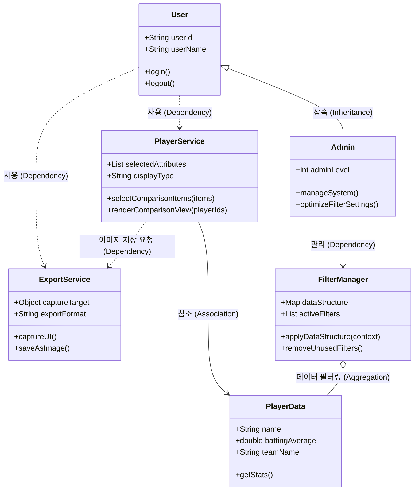
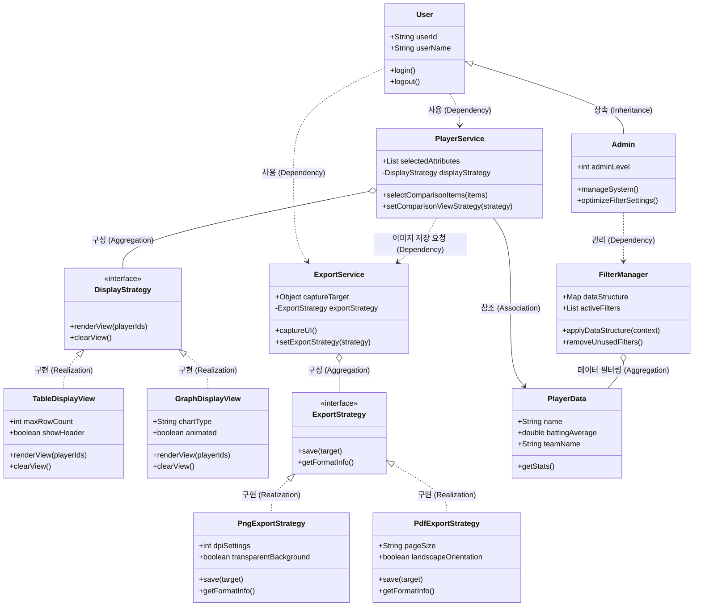

# 8-1 적용 패턴 개요
| 항목 | 내용 |
|----|--------------|
|패턴명|전략 패턴|
|분류|행동|
|적용 대상 클래스|PlayerService,ExportService|
|선택이유|PlayerService의 renderComparisonView는 displayType(예: 그래프 view, 테이블 view 등)에 따라 변경될 수 있으며, ExportService의 saveAsImage 또한 exportFormat(예: PNG, JPG, PDF 등)에 따라 동적으로 확장될 가능성이 높습니다. 만약 이를 단일 클래스 내부에서 if-else 조건문으로 처리하면 새로운 형식이나 뷰가 추가될 때마다 기존 코드를 수정해야 하므로 개방-폐쇄 원칙(OCP)을 위배하고 유지보수성이 떨어집니다. 따라서 변경 가능성이 높은 알고리즘(렌더링 방식, 파일 저장 포맷)을 인터페이스로 캡슐화하고 동적으로 교체할 수 있도록 전략 패턴을 적용했습니다.|

# 8-2 패턴 적용 다이어그램

#변경전

#변경후

