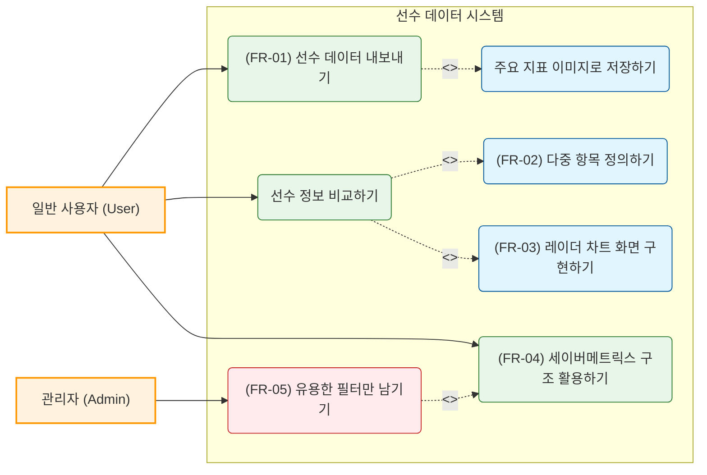
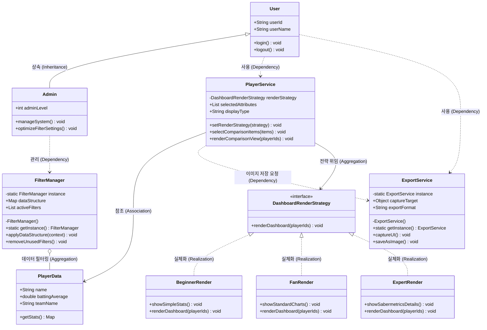

# 8-1 적용 패턴 개요
| 항목 | 내용 |
|----|--------------|
|패턴명|싱글톤 패턴|
|분류|생성|
|적용 대상 클래스|FilterManager, ExportService|
|선택이유|야구 정보 조회 시스템에서는 대용량의 선수 원천 데이터 세트와 세이버메트릭스 지표 연산용 필터를 전역에서 일관되게 관리해야 합니다. FilterManager 인스턴스가 여러 개 생성될 경우 필터 기준이 혼선되거나 리소스 낭비가 발생할 수 있습니다. 또한 기기 저장용 파일 출력을 담당하는 ExportService 역시 시스템 내에서 단 하나의 제어권을 유지해야 파일 쓰기 충돌이나 핸들러 낭비가 없습니다.두 클래스의 생성자를 private으로 제한하고 내부에서 단 하나의 정적 객체 인스턴스만을 유지하도록 getInstance() 메서드를 구현하여 시스템 전역에서 동일한 필터 상태와 출력 엔진을 공유하도록 설계했습니다.|

| 항목 | 내용 |
|----|--------------|
|패턴명|전략 패턴|
|분류|행동|
|적용 대상 클래스|PlayerService, DashboardRenderStrategy|
|선택이유|기기 환경이나 사용자 등급(입문자 모드, 일반 팬 모드, 분석가 모드)에 따라 화면에 데이터를 바인딩하고 시각화하는 알고리즘이 완전히 달라집니다. 이를 단일 메서드 내의 거대한 if-else문으로 처리하면 향후 새로운 지표나 시각화 모드가 추가될 때 소스 코드가 매우 복잡해지고 유지보수가 불가능해집니다.대시보드 렌더링 방식을 DashboardRenderStrategy 인터페이스로 정의하여 각 모드별 알고리즘 클래스(BeginnerRender, FanRender, ExpertRender)로 독립 분리했습니다. PlayerService는 사용자가 선택한 모드 전략 객체를 주입받아 동적으로 renderComparisonView()를 수행하도록 OCP(개방-폐쇄 원칙)를 준수하여 설계했습니다.|

# 8-2 패턴 적용 다이어그램

#변경전

#변경후

