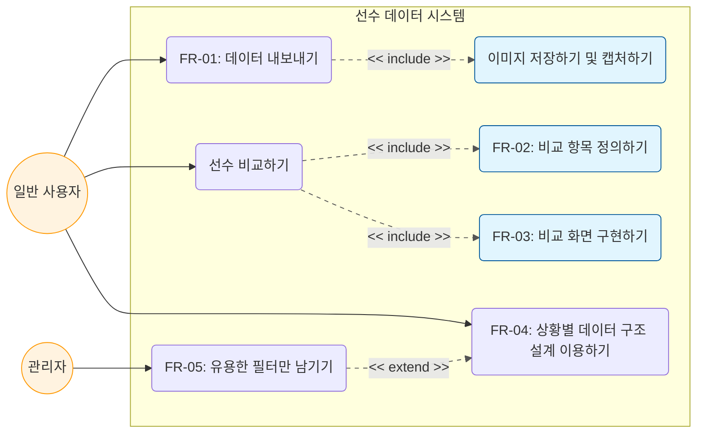
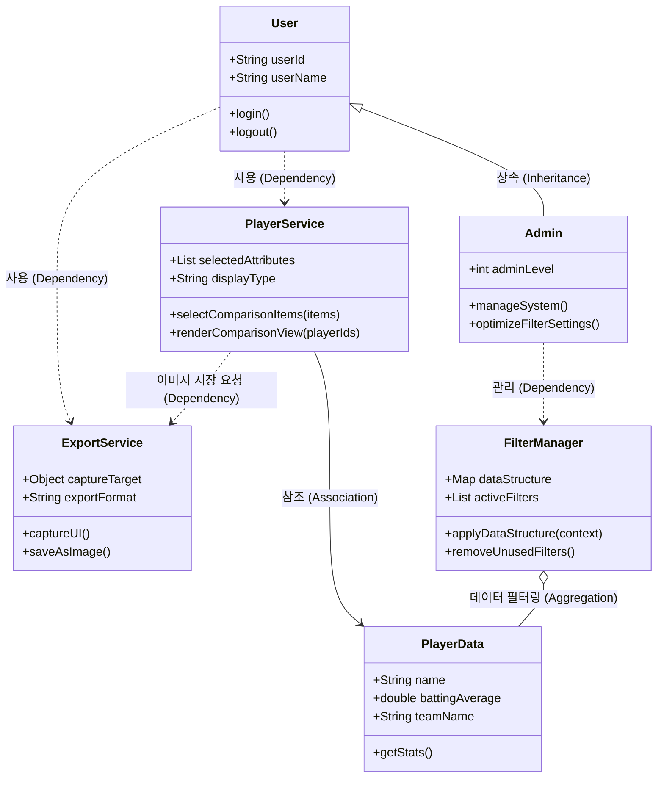

## 유스케이스 다이어그램

```mermaid
graph LR
    %% Actors
    User((일반 사용자))
    Admin((관리자))

    subgraph "선수 데이터 시스템"
        %% Use Cases (동사형으로 변경)
        UC1(FR-01: 데이터 내보내기)
        UC1_sub(이미지 저장하기 및 캡처하기)
        
        UC2(선수 비교하기)
        UC2_sub1(FR-02: 비교 항목 정의하기)
        UC2_sub2(FR-03: 비교 화면 구현하기)
        
        UC3(FR-04: 상황별 데이터 구조 설계 이용하기)
        UC3_sub(FR-05: 유용한 필터만 남기기)
    end

    %% Relationships: Actor to UC
    User --> UC1
    User --> UC2
    User --> UC3
    Admin --> UC3_sub

    %% Include Relationships (Base -> Inclusion)
    UC1 -.->|"<< include >>"| UC1_sub
    UC2 -.->|"<< include >>"| UC2_sub1
    UC2 -.->|"<< include >>"| UC2_sub2

    %% Extend Relationships (Extension -> Base)
    UC3_sub -.->|"<< extend >>"| UC3

    %% Styling
    style User fill:#fff3e0,stroke:#ff9800
    style Admin fill:#fff3e0,stroke:#ff9800
    style UC1_sub fill:#e1f5fe,stroke:#01579b
    style UC2_sub1 fill:#e1f5fe,stroke:#01579b
    style UC2_sub2 fill:#e1f5fe,stroke:#01579b
    linkStyle 4,5,6,7 stroke:#555,stroke-dasharray: 5
```

## 클래스 다이어그램

```mermaid
classDiagram
    %% 클래스 정의
    class User {
        +String userId
        +String userName
        +login()
        +logout()
    }

    class Admin {
        +int adminLevel
        +manageSystem()
        +optimizeFilterSettings()
    }

    class PlayerService {
        +List selectedAttributes
        +String displayType
        +selectComparisonItems(items)
        +renderComparisonView(playerIds)
    }

    class ExportService {
        +Object captureTarget
        +String exportFormat
        +captureUI()
        +saveAsImage()
    }

    class FilterManager {
        +Map dataStructure
        +List activeFilters
        +applyDataStructure(context)
        +removeUnusedFilters()
    }

    class PlayerData {
        +String name
        +double battingAverage
        +String teamName
        +getStats()
    }

    %% 관계 설정
    User <|-- Admin : 상속 (Inheritance)
    User ..> PlayerService : 사용 (Dependency)
    User ..> ExportService : 사용 (Dependency)
    Admin ..> FilterManager : 관리 (Dependency)
    
    PlayerService --> PlayerData : 참조 (Association)
    PlayerService ..> ExportService : 이미지 저장 요청 (Dependency)
    FilterManager o-- PlayerData : 데이터 필터링 (Aggregation)
```

