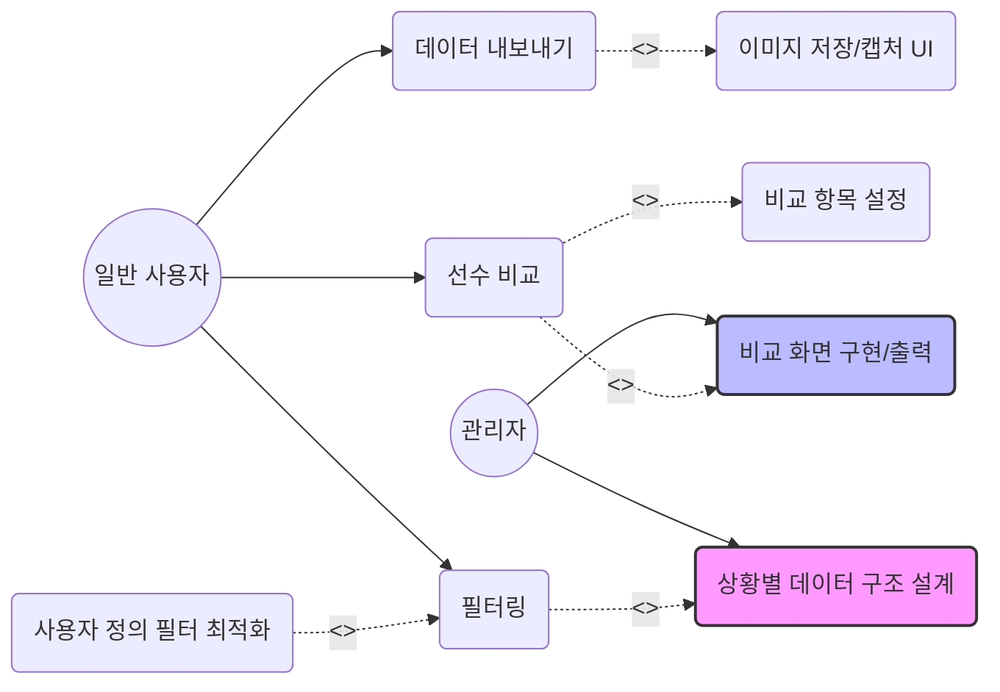
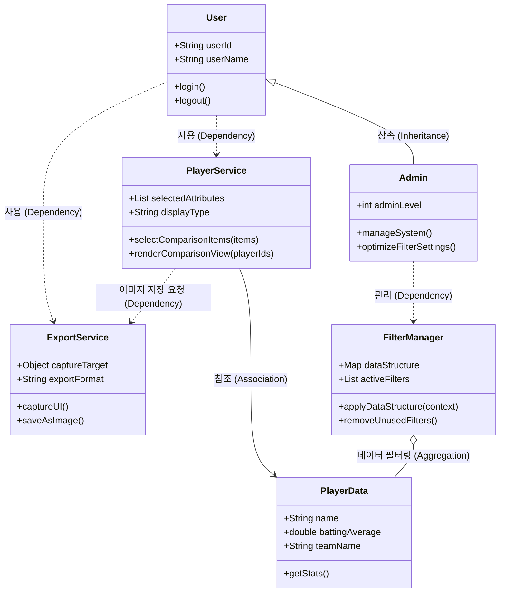

## 유스케이스 다이어그램

```mermaid
graph LR
    %% Actors
    User((일반 사용자))
    Admin((관리자))

    %% Usecases
    UC1(데이터 내보내기)
    UC1_1(이미지 저장/캡처 UI)
    
    UC2(선수 비교)
    UC2_1(비교 항목 설정)
    UC2_2(비교 화면 구현/출력)
    
    UC3(필터링)
    UC3_1(상황별 데이터 구조 설계)
    UC3_2(사용자 정의 필터 최적화)

    %% Relationships: User
    User --> UC1
    User --> UC2
    User --> UC3

    %% Relationships: Admin (System Management)
    Admin --> UC3_1
    Admin --> UC2_2

    %% Include/Extend logic
    UC1 -.->|"<<include>>"| UC1_1
    
    UC2 -.->|"<<include>>"| UC2_1
    UC2 -.->|"<<include>>"| UC2_2
    
    UC3 -.->|"<<include>>"| UC3_1
    UC3_2 -.->|"<<extend>>"| UC3

    %% Styling
    style UC3_1 fill:#f9f,stroke:#333,stroke-width:2px
    style UC2_2 fill:#bbf,stroke:#333,stroke-width:2px
```

## 클래스 다이어그램

```mermaid
classDiagram
    %% 클래스 정의
    class User {
        +String userId
        +String userName
        +login()
        +logout()
    }

    class Admin {
        +int adminLevel
        +manageSystem()
        +optimizeFilterSettings()
    }

    class PlayerService {
        +List selectedAttributes
        +String displayType
        +selectComparisonItems(items)
        +renderComparisonView(playerIds)
    }

    class ExportService {
        +Object captureTarget
        +String exportFormat
        +captureUI()
        +saveAsImage()
    }

    class FilterManager {
        +Map dataStructure
        +List activeFilters
        +applyDataStructure(context)
        +removeUnusedFilters()
    }

    class PlayerData {
        +String name
        +double battingAverage
        +String teamName
        +getStats()
    }

    %% 관계 설정
    User <|-- Admin : 상속 (Inheritance)
    User ..> PlayerService : 사용 (Dependency)
    User ..> ExportService : 사용 (Dependency)
    Admin ..> FilterManager : 관리 (Dependency)
    
    PlayerService --> PlayerData : 참조 (Association)
    PlayerService ..> ExportService : 이미지 저장 요청 (Dependency)
    FilterManager o-- PlayerData : 데이터 필터링 (Aggregation)
```

